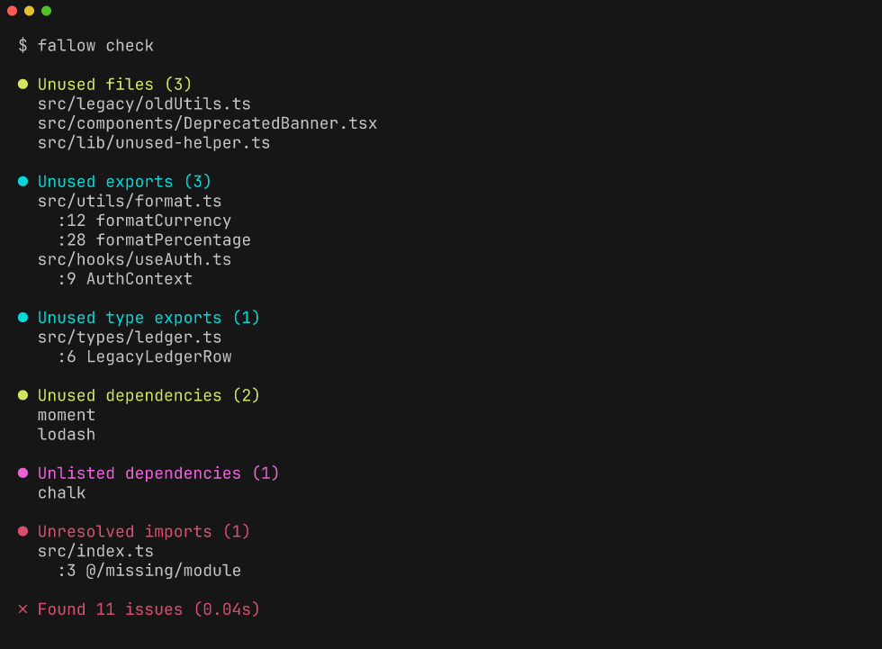

<p align="center">
  <br>
  <strong>Dead code detection for JavaScript and TypeScript — in milliseconds, not minutes.</strong><br><br>
  <a href="https://github.com/BartWaardenburg/fallow/actions/workflows/ci.yml"></a>
  <a href="https://github.com/BartWaardenburg/fallow/actions/workflows/coverage.yml"></a>
  <a href="https://crates.io/crates/fallow-cli"></a>
  <a href="https://www.npmjs.com/package/fallow"></a>
  <a href="LICENSE"></a><br>
  <a href="#quick-start">Quick Start</a> ·
  <a href="#benchmarks">Benchmarks</a> ·
  <a href="#what-it-finds">What It Finds</a> ·
  <a href="#configuration">Configuration</a> ·
  <a href="#comparison-with-knip">Comparison</a>
</p>

---

fallow is a drop-in alternative to [knip](https://knip.dev) that runs **25–40x faster** on real-world projects by using the [Oxc](https://oxc.rs) parser instead of the TypeScript compiler. It detects unused files, exports, dependencies, types, enum members, and class members in JavaScript and TypeScript codebases.

```bash
npx fallow check    # zero config, sub-second results
```

<p align="center">
  
</p>

Regenerate this screenshot with `scripts/generate-readme-screenshot.sh` (uses `freeze`).

## Why fallow?

**knip is good. fallow is fast.**

knip relies on the TypeScript compiler on every run — even though finding dead code doesn't require type information. For a 2,000-file monorepo, that means 30–60 seconds of waiting.

fallow takes a different approach:

- **Oxc parser** — syntactic analysis only, no type-checking overhead
- **Parallel parsing** — every file parsed on its own rayon thread with a per-task allocator, zero contention during parsing
- **Incremental cache** — xxh3 content hashing + bincode serialization, only changed files are reparsed
- **Flat graph storage** — contiguous `Vec<Edge>` with range indices for cache-friendly traversal

The result: sub-second analysis on codebases where knip takes a minute.

Detection accuracy has been validated against knip across 31 open-source projects. Since fallow uses syntactic analysis only (no type information), there are edge cases where results differ — see [Limitations](#limitations) below.

### Benchmarks

Measured on real-world open-source projects (median of 5 runs, 2 warmup):

| Project | Files | fallow | knip | Speedup |
|:--------|------:|-------:|-----:|--------:|
| [zod](https://github.com/colinhacks/zod) | 174 | **16ms** | 582ms | **35.8x** |
| [fastify](https://github.com/fastify/fastify) | 286 | **20ms** | 804ms | **39.4x** |
| [preact](https://github.com/preactjs/preact) | 244 | **29ms** | 771ms | **26.6x** |

<details>
<summary>Scaling behavior on synthetic projects</summary>

At small sizes, knip's fixed startup cost dominates. At larger scales, per-file costs converge — but fallow remains faster at every size:

| Size | Files | fallow | knip | Speedup |
|:-----|------:|-------:|-----:|--------:|
| tiny | 11 | **5ms** | 271ms | **53.2x** |
| small | 51 | **7ms** | 280ms | **41.7x** |
| medium | 201 | **12ms** | 299ms | **25.0x** |
| large | 1,001 | **42ms** | 372ms | **8.8x** |
| xlarge | 5,001 | **186ms** | 610ms | **3.3x** |

</details>

<details>
<summary>Reproduce these benchmarks</summary>

```bash
cd benchmarks
npm install
node generate-fixtures.mjs    # Generate synthetic projects
node download-fixtures.mjs    # Clone real-world projects
node bench.mjs                # Run all benchmarks
```

</details>

## Quick start

```bash
npx fallow check
```

Run it in any JavaScript or TypeScript project — no configuration needed. See something you want to fix? Run `fallow fix --dry-run` to preview auto-removal.

Or install globally:

```bash
npm install -g fallow        # npm (prebuilt binaries via optionalDependencies)
cargo install fallow-cli     # cargo
```

## What it finds

| Issue | Description |
|:------|:------------|
| **Unused files** | Not reachable from any entry point |
| **Unused exports** | Exported symbols never imported elsewhere |
| **Unused types** | Type aliases and interfaces never referenced |
| **Unused dependencies** | Packages in `dependencies` never imported |
| **Unused devDependencies** | Packages in `devDependencies` never imported |
| **Unused enum members** | Enum values never referenced in your code |
| **Unused class members** | Class methods and properties never referenced |
| **Unresolved imports** | Import specifiers that cannot be resolved |
| **Unlisted dependencies** | Imported packages missing from `package.json` |
| **Duplicate exports** | Same symbol exported from multiple modules |

## Key differentiators

Both fallow and knip offer watch mode, auto-fix, caching, and LSP support. fallow's unique features:

- **Git-aware analysis** — only report file-scoped issues in files changed since a branch (`--changed-since main`); dependency-level issues are always reported
- **Baseline comparison** — save a snapshot, only fail CI on *new* issues (tracks unused files, exports, types, and dependencies)
- **SARIF output** — native GitHub Code Scanning integration
- **GitHub Action** — drop-in CI with [one line of YAML](#github-actions)
- **Speed** — 25–40x faster on real-world projects, with parallel parsing and incremental caching

## Usage

```bash
fallow check                          # Analyze current directory
fallow check --format json            # Machine-readable JSON
fallow check --format sarif           # SARIF for GitHub Code Scanning
fallow check --format compact         # One issue per line, grep-friendly

fallow watch                          # Re-analyze on file changes

fallow fix                            # Auto-remove unused exports and deps
fallow fix --dry-run                  # Preview what would change

fallow check --changed-since main     # Only issues in changed files
fallow check --save-baseline b.json   # Snapshot current state
fallow check --baseline b.json        # Fail only on new issues

fallow init                           # Create fallow.toml
fallow list --frameworks              # Show detected frameworks
fallow list --entry-points            # Show entry points
fallow list --files                   # Show discovered files
```

## Configuration

Create `fallow.toml` in your project root, or run `fallow init`:

```toml
# Additional entry points beyond auto-detected ones
entry = ["src/workers/*.ts", "scripts/*.ts"]

# Patterns to exclude from analysis
ignore = ["**/*.generated.ts", "**/*.d.ts"]

# Dependencies to always consider as used
ignore_dependencies = ["autoprefixer", "@types/node"]

# What to detect (all default to true)
[detect]
unused_files = true
unused_exports = true
unused_dependencies = true
unused_dev_dependencies = true
unused_types = true
unused_enum_members = true
unused_class_members = true
unresolved_imports = true
unlisted_dependencies = true
duplicate_exports = true
```

<details>
<summary><strong>Ignoring specific exports</strong></summary>

```toml
# Ignore all exports from utility files
[[ignore_exports]]
file = "src/utils/**"
exports = ["*"]

# Ignore a specific export
[[ignore_exports]]
file = "src/types.ts"
exports = ["InternalType"]
```

</details>

<details>
<summary><strong>Custom framework presets</strong></summary>

```toml
[[framework]]
name = "my-framework"
always_used = ["my-framework.config.ts"]

[framework.detection]
type = "dependency"
package = "my-framework"

[[framework.entry_points]]
pattern = "src/routes/**/*.ts"

[[framework.used_exports]]
file_pattern = "src/routes/**/*.ts"
exports = ["default", "loader"]
```

</details>

## Framework support

fallow auto-detects 23 frameworks and adjusts entry points and used exports for each:

| Framework | Detection |
|:----------|:----------|
| Next.js | `next` in dependencies |
| Vite | `vite` in dependencies |
| Vitest | `vitest` in dependencies |
| Jest | `jest` in dependencies |
| Storybook | `.storybook/main.{ts,js}` exists |
| Remix | any `@remix-run/*` package in dependencies |
| Astro | `astro` in dependencies |
| Nuxt | `nuxt` in dependencies |
| Angular | `@angular/core` in dependencies |
| Playwright | `@playwright/test` in dependencies |
| Prisma | `prisma` in dependencies |
| ESLint | `eslint` in dependencies |
| TypeScript | `typescript` in dependencies |
| Webpack | `webpack` in dependencies |
| Tailwind CSS | `tailwindcss` or `@tailwindcss/postcss` in dependencies |
| GraphQL Codegen | `@graphql-codegen/cli` in dependencies |
| React Router | `react-router`, `react-router-dom`, or `@react-router/dev` in dependencies |
| React Native | `react-native` in dependencies |
| Expo | `expo` in dependencies |
| Sentry | `@sentry/nextjs`, `@sentry/react`, or `@sentry/node` in dependencies |
| Drizzle | `drizzle-orm` in dependencies |
| Knex | `knex` in dependencies |
| MSW | `msw` in dependencies |

knip has broader framework coverage (140+ plugins). If your framework isn't supported, you can [add a custom preset](#custom-framework-presets) in `fallow.toml`.

## Workspace support

fallow supports npm, yarn, and pnpm workspaces out of the box — including `pnpm-workspace.yaml`. Run `fallow check` at the workspace root and it discovers all packages automatically.

## CI integration

### GitHub Actions

The [fallow GitHub Action](https://github.com/BartWaardenburg/fallow) installs fallow, runs analysis, posts a job summary, and optionally uploads SARIF results to Code Scanning or comments on PRs.

**Basic usage (SARIF upload to Code Scanning):**

```yaml
- uses: BartWaardenburg/fallow@v0
  with:
    format: sarif
```

Requires `security-events: write` permission. Results appear in the **Security** tab under Code Scanning alerts.

**PR-only analysis with comments:**

```yaml
- uses: actions/checkout@v4
  with:
    fetch-depth: 0
- uses: BartWaardenburg/fallow@v0
  with:
    format: json
    comment: 'true'
    changed-since: origin/${{ github.base_ref }}
```

Requires `fetch-depth: 0` on checkout and `pull-requests: write` permission.

**Full workflow example:**

```yaml
name: Dead Code Check
on:
  pull_request:
  push:
    branches: [main]

permissions:
  contents: read
  security-events: write
  pull-requests: write

jobs:
  fallow:
    runs-on: ubuntu-latest
    steps:
      - uses: actions/checkout@v4
        with:
          fetch-depth: 0
      - uses: BartWaardenburg/fallow@v0
        with:
          format: sarif
          comment: 'true'
          changed-since: ${{ github.event_name == 'pull_request' && format('origin/{0}', github.base_ref) || '' }}
```

<details>
<summary><strong>Action inputs</strong></summary>

| Input | Default | Description |
|:------|:--------|:------------|
| `root` | `.` | Project root directory |
| `format` | `sarif` | Output format: `human`, `json`, `sarif`, `compact` |
| `fail-on-issues` | `true` | Exit with code 1 if issues are found |
| `changed-since` | — | Only report issues in files changed since this git ref |
| `baseline` | — | Path to baseline file for comparison |
| `version` | `latest` | Fallow version to install |
| `args` | — | Additional CLI arguments |
| `comment` | `false` | Post results as a PR comment |
| `github-token` | `github.token` | Token for PR comments and SARIF upload |

**Outputs:** `results` (JSON file path), `sarif` (SARIF file path), `issues` (count).

</details>

Or run the CLI directly:

```yaml
- name: Run fallow
  run: npx fallow check --format sarif > results.sarif

- name: Upload SARIF
  uses: github/codeql-action/upload-sarif@v4
  with:
    sarif_file: results.sarif
```

### Baseline workflow

Prevent dead code from growing without blocking PRs on existing debt:

```yaml
# On main: save baseline
- run: npx fallow check --save-baseline fallow-baseline.json --quiet
- uses: actions/upload-artifact@v4
  with:
    name: fallow-baseline
    path: fallow-baseline.json

# On PRs: fail only on new issues
- uses: actions/download-artifact@v4
  with:
    name: fallow-baseline
- run: npx fallow check --baseline fallow-baseline.json --fail-on-issues
```

### Output formats

| Format | Use case |
|:-------|:---------|
| `human` | Colored terminal output with grouped categories |
| `json` | Machine-readable, full result data |
| `sarif` | SARIF 2.1.0 — GitHub Code Scanning, VS Code SARIF Viewer |
| `compact` | One issue per line — `grep`, `awk`, shell scripts |

## Comparison with knip

| | fallow | knip |
|:--|:-------|:-----|
| Language | Rust | TypeScript |
| Parser | Oxc (syntactic only) | TypeScript compiler |
| Parallelism | rayon (all cores) | Single-threaded |
| Speed | **25–40x faster** (real-world) | Baseline |
| Watch mode | Yes | Yes |
| Auto-fix | Yes | Yes |
| LSP server | Yes | Yes |
| Incremental cache | Yes | Yes |
| Git-aware analysis | Yes | No |
| Baseline comparison | Yes | No |
| SARIF output | Yes | No |
| GitHub Action | Yes | — |
| Vue/Svelte SFC parsing | Yes | Yes |
| Dynamic import resolution | **Yes (partial)** | No |
| Framework plugins | 23 | 140+ |
| Detection types | 10 | 10 |

fallow intentionally covers the same 10 detection types as knip. The difference is in speed, CI integration, and git-aware workflows — not in what it detects.

<details>
<summary><strong>How it works</strong></summary>

```
                      ┌─────────────────────┐
                      │   fallow.toml +      │
                      │   package.json       │
                      └─────────┬───────────┘
                                │
                      ┌─────────▼───────────┐
                      │   File Discovery     │
                      │   (gitignore-aware   │
                      │    + workspaces)     │
                      └─────────┬───────────┘
                                │
                ┌───────────────┼───────────────┐
                │               │               │
         ┌──────▼──────┐ ┌─────▼──────┐ ┌──────▼──────┐
         │  Parse (oxc) │ │ Parse (oxc) │ │ Parse (oxc) │  ← rayon threads
         │  per-task    │ │ per-task    │ │ per-task    │    with own allocators
         │  allocator   │ │ allocator   │ │ allocator   │
         └──────┬──────┘ └─────┬──────┘ └──────┬──────┘
                │               │               │
                └───────────────┼───────────────┘
                                │
                      ┌─────────▼───────────┐
                      │  Module Resolution   │
                      │  (oxc_resolver)      │
                      └─────────┬───────────┘
                                │
                      ┌─────────▼───────────┐
                      │  Graph Construction  │
                      │  (flat Vec<Edge>     │
                      │   + range indices)   │
                      └─────────┬───────────┘
                                │
                      ┌─────────▼───────────┐
                      │  Re-export Chain     │
                      │  Resolution          │
                      │  (iterative, max 20  │
                      │   rounds, cycle-safe)│
                      └─────────┬───────────┘
                                │
                      ┌─────────▼───────────┐
                      │  BFS Reachability    │
                      │  from entry points   │
                      │  (FixedBitSet)       │
                      └─────────┬───────────┘
                                │
                      ┌─────────▼───────────┐
                      │  Dead Code Detection │
                      │  (10 issue types)    │
                      └─────────────────────┘
```

**Key design decisions:**

1. **No TypeScript compiler.** Dead code detection is a graph problem on import/export edges — you don't need type information. Oxc gives us a full AST at native speed.

2. **Flat edge storage.** Module graph edges live in a single contiguous `Vec<Edge>`. Each node stores a `Range<usize>` into this vec. This is dramatically more cache-friendly than `HashMap<NodeId, Vec<Edge>>` and matters when traversing graphs with tens of thousands of edges.

3. **Per-task Oxc allocators.** Each rayon task creates its own `oxc_allocator::Allocator`. No Arc, no Mutex, no contention during the parsing phase.

4. **Iterative re-export resolution.** Barrel files (`index.ts` re-exporting from submodules) create chains that need to be resolved transitively. fallow propagates usage through these chains iteratively with cycle detection, up to 20 rounds.

</details>

## Vue and Svelte support

fallow parses `.vue` and `.svelte` single-file components out of the box. `<script>` and `<script setup>` blocks are extracted and analyzed for imports and exports, including TypeScript (`lang="ts"`). This means imports inside Vue/Svelte components correctly mark exports as used, and orphaned `.vue`/`.svelte` files are detected as unused.

> **Note:** Component references in `<template>` blocks are not tracked. An import used only in the template (not in `<script>`) may be reported as unused — the same limitation as knip. Use [`ignore_exports`](#ignoring-specific-exports) to suppress these.

## Smart dynamic import resolution

fallow goes beyond knip by partially resolving dynamic imports with variable paths — no other dead code tool does this:

```typescript
// Template literals: fallow extracts "./locales/" prefix + ".json" suffix → glob matches all locale files
const locale = import(`./locales/${lang}.json`);

// String concatenation: fallow extracts "./pages/" prefix → glob matches all page files
const page = import('./pages/' + pageName);

// Vite import.meta.glob: patterns are used directly as globs
const modules = import.meta.glob('./components/*.tsx');

// Webpack require.context: directory + recursive flag → glob pattern
const icons = require.context('./icons', true, /\.svg$/);
```

Files matched by these patterns are correctly marked as reachable, eliminating false "unused file" reports for code-split and lazy-loaded modules.

Fully dynamic imports with no static prefix (e.g., `import(variable)`) remain unresolvable — this is a fundamental limitation of static analysis.

## Limitations

fallow uses syntactic analysis only — no type information. This is what makes it fast, but it means:

- **Type-level dead code** (e.g., unreachable branches via type narrowing) is out of scope — fallow detects unused *exports*, not unreachable *code within functions*. This requires a full type checker and is better handled by `typescript-eslint/no-unnecessary-condition`.
- **Svelte `export let` props** may be reported as unused exports. Svelte uses `export let` for component props, which looks like an export to static analysis. Use [`ignore_exports`](#ignoring-specific-exports) to suppress these.

If fallow reports a false positive, you can suppress it with [`ignore_exports`](#ignoring-specific-exports) in `fallow.toml`.

## Building from source

```bash
git clone https://github.com/bartwaardenburg/fallow
cd fallow
cargo install --path crates/cli
```

```bash
cargo test --workspace           # Run all tests
cargo clippy --workspace         # Lint
cargo bench -p fallow-core       # Run benchmarks
```

## Contributing

fallow is pre-1.0 and contributions are welcome. See the [issue tracker](https://github.com/BartWaardenburg/fallow/issues) for open bugs and feature requests.

```bash
cargo build --workspace && cargo test --workspace
```

## License

MIT

---

<p align="center">
  <strong>Try it:</strong> <code>npx fallow check</code><br>
  <a href="https://github.com/BartWaardenburg/fallow/issues">Report a bug</a> · <a href="https://github.com/BartWaardenburg/fallow/issues/new?template=feature_request.yml">Request a feature</a>
</p>
